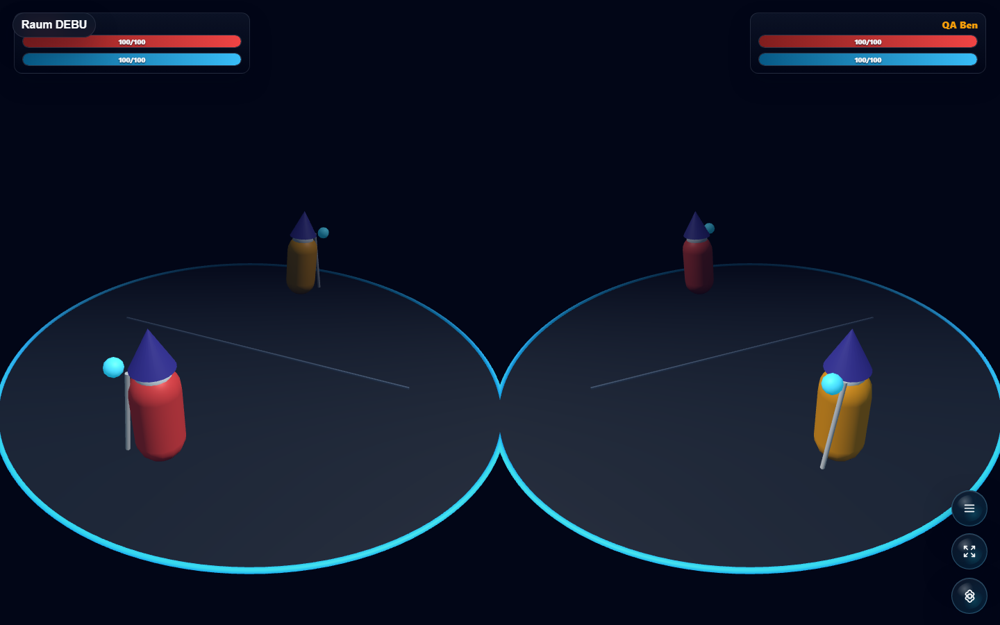
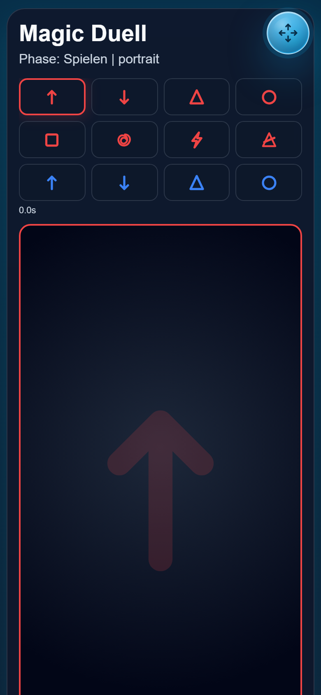

# Magic Duell

Recommended alpha 3D wizard duel for Open Party Lab with phone-drawn spells.





## Status

Recommended alpha. The 1v1 duel loop is playable with a split 3D host view, mana, shields, projectiles, cooldowns, and gesture-cast spells. Players can choose their available spell loadout in the controller lobby before readying up.

## Run Through Open Party Lab

This repo is not a standalone app. Run it through the Open Party Lab platform.

Recommended layout:

```text
Open-Party-Lab/
  local-games/
    magic-duell/
```

From the Platform repo:

```bash
npm install
npm run games:sync-local
npm run dev:all
```

The Platform loads this game only when the repo exists locally and `npm run games:sync-local` links it. Missing optional games are skipped.

## GitHub Metadata

Description:

```text
Recommended alpha 3D wizard duel for Open Party Lab with phone-drawn spells.
```

Suggested topics:

```text
open-party-lab party-game browser-game threejs phaser typescript local-multiplayer wizard-duel gesture-controls 3d-game
```

## Package Entrypoints

- `@open-party-lab/game-magic-duell/manifest`
- `@open-party-lab/game-magic-duell/protocol`
- `@open-party-lab/game-magic-duell/server`
- `@open-party-lab/game-magic-duell/host`
- `@open-party-lab/game-magic-duell/controller`

The Platform should import only these public entrypoints.

## Development Checks

```bash
npm install
npm run typecheck
npm run build
npm run pack:dry-run
```

For visual checks, start Open Party Lab, add virtual controllers when needed, and capture host/controller screenshots through a browser.

## License

Code is licensed under the Apache License 2.0. See [LICENSE](LICENSE).

Assets, generated media, prompts, and third-party references may need separate rights review before public store distribution.
